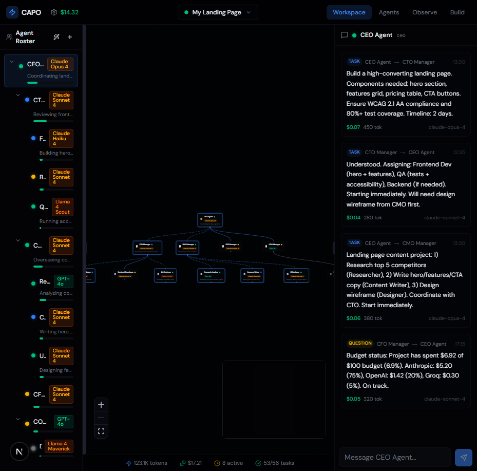
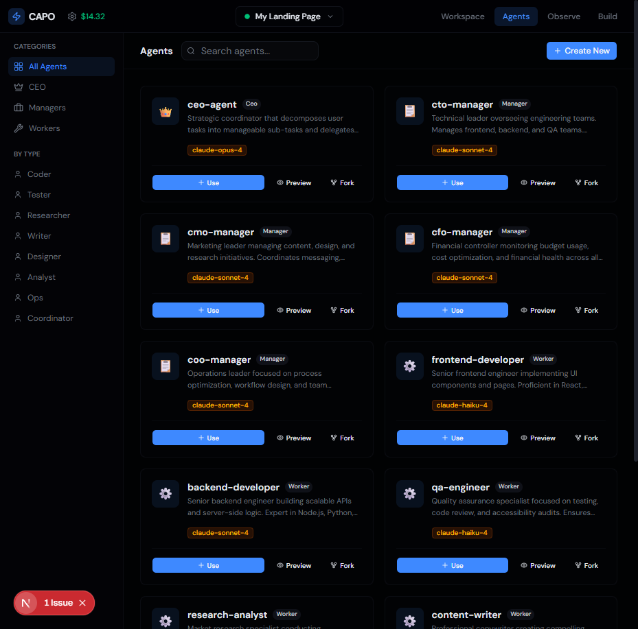
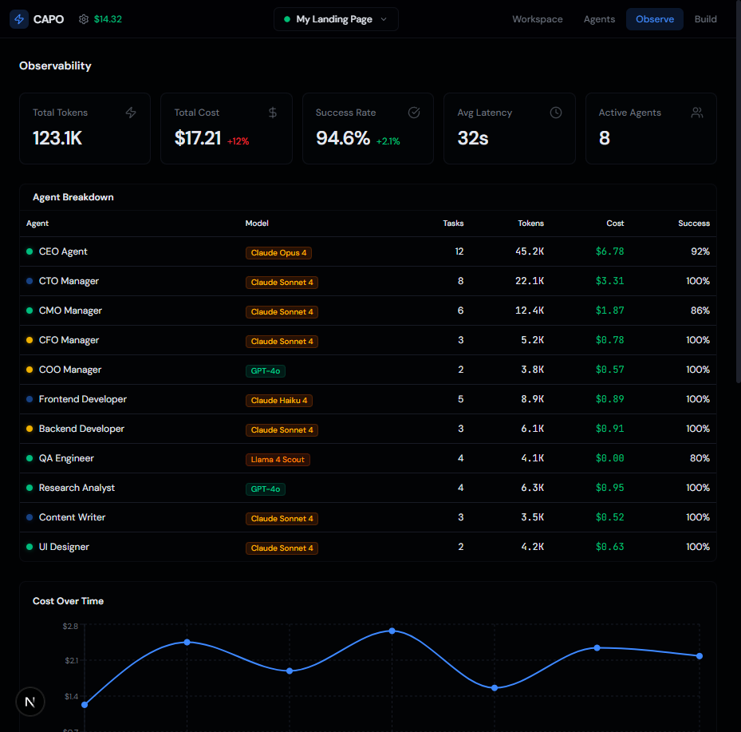
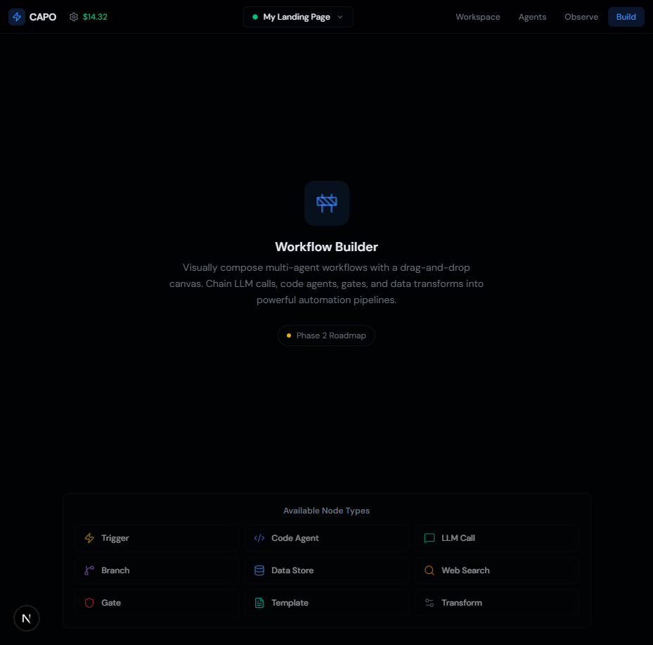
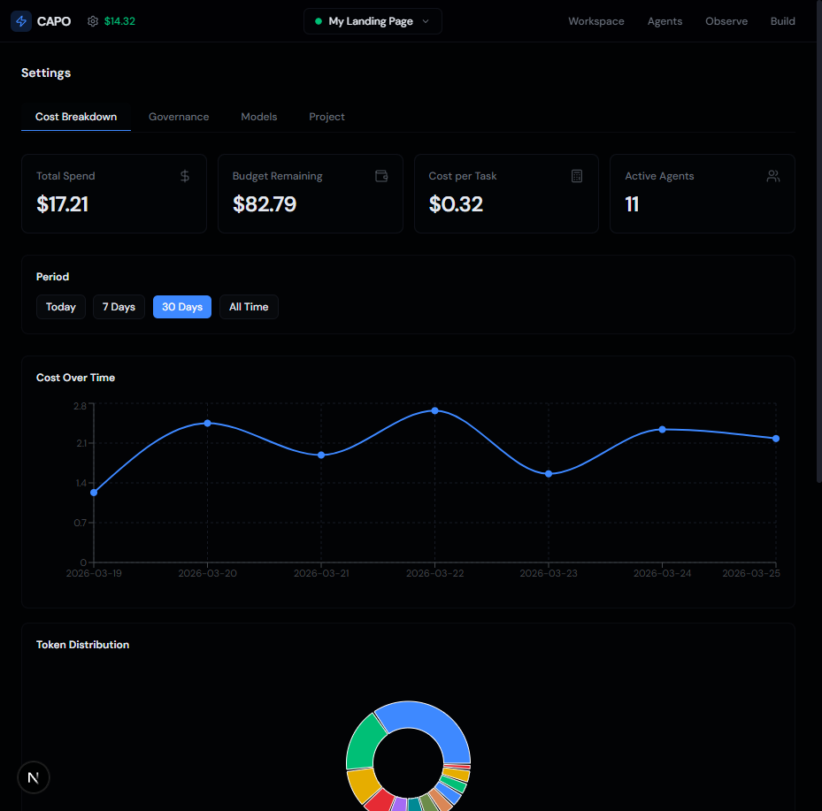

# CAPO — Command and Agent Protocol Orchestrator

**The operating system for AI workforces.**

CAPO is a platform where multiple AI agents collaborate like employees in a company — with hierarchy, accountability, budgets, and transparent workflows — to complete complex tasks that no single agent can handle alone.

> The agent is disposable. The orchestration is the moat.



---

## What is CAPO?

Any LLM can generate text. The value is in how agents are **composed**, **governed**, **observed**, and **coordinated**. CAPO provides the orchestration layer that turns commodity AI models into structured, auditable, cost-controlled agent teams.

CAPO fills gaps that no existing platform addresses:

| Gap | CAPO Solution |
|-----|---------------|
| No unified multi-model + multi-agent orchestration | Per-agent model assignment with intelligent routing |
| No visual builder with bidirectional code sync | Visual DAG builder ↔ YAML ↔ Code, all synchronized |
| No built-in per-agent token budget governance | 5-level cascade budget enforcement with hard stops |
| No native memory architecture | Working + Episodic + Semantic + Procedural memory |
| Enterprise governance not built-in from day one | Approval gates on spawn, budget, actions, strategy |
| No flexible hierarchy (top-down AND peer) | Hierarchical, mesh, and hybrid topologies |
| No cross-framework interop | Native MCP tool protocol + A2A agent delegation |
| No universal observability dashboard | Prompt inspector, cost tracker, timeline view |

---

## Screenshots

### Agents Dashboard
Browse, search, and configure your entire agent team. Each agent card shows its role, model assignment, status, and budget at a glance.



### Observability
Real-time metrics — total tokens, spend, success rate, active agents — with per-agent breakdowns and cost-over-time charts.



### Workspace
The command center: workflow canvas with agent DAG visualization, agent roster sidebar, and chat panel for direct agent interaction.


### Workflow Builder (Phase 2)
Visually compose multi-agent workflows with drag-and-drop. Chain LLM calls, code agents, gates, and data transforms into automation pipelines.



### Cost & Budget Settings
Track total spend, budget remaining, average cost per task, and token distribution across models — with historical cost charts.



---

## Core Features

### Multi-Model Orchestration
Assign different LLM models to different agents based on task complexity. Route simple tasks to fast/cheap models (Haiku, Groq) and reserve frontier models (GPT-4o, Claude Opus) for complex reasoning — achieving up to 70% cost reduction.

### Agent Team Management
- **Role-based agents**: CEO, Manager, Worker hierarchy mirroring a real company
- **Per-agent configuration**: Model, budget, tools, memory, constraints, and prompt — all configurable per agent
- **12+ agent roles** out of the box: CEO Agent, CTO Manager, Frontend/Backend Developers, QA Engineer, Research Analyst, and more

### Visual Workflow Builder
Drag-and-drop DAG canvas to compose multi-agent workflows. Available node types:
- Trigger, Code Agent, LLM Call, Branch, Data Store, Web Search, Gate, Template, Transform

### Observability Dashboard
- **Token tracking**: Total tokens consumed across all agents
- **Cost monitoring**: Real-time spend with per-agent breakdown
- **Success rate**: Task completion percentage
- **Timeline view**: Gantt-style visualization of agent activity
- **Cost forecast**: Predictive spend charts

### Budget Governance
5-level cascade budget enforcement:
1. **Organization** — global spending cap
2. **Project** — per-project allocation
3. **Workspace** — per-workspace limits
4. **Agent** — per-agent token budgets
5. **Task** — per-task hard stops

### Quad-Memory Architecture
Four memory tiers mapped to human cognitive science:

| Layer | Scope | Persistence | Use Case |
|-------|-------|-------------|----------|
| Working | Current task | Cleared after task | Active context, scratchpad |
| Episodic | Per agent | Session-persistent | Past interactions, decisions |
| Semantic | Cross-agent | Persistent | Domain knowledge, facts |
| Procedural | Cross-agent | Persistent | Learned behaviors, SOPs |

### Hybrid Topology
Four coordination topologies, selectable per workspace:

| Topology | Structure | Best For |
|----------|-----------|----------|
| Hierarchical | CEO → Managers → Workers | Structured delegation chains |
| Mesh | Peer-to-peer | Creative brainstorming, research |
| Hierarchical-Mesh | CEO delegates to peer groups | Complex projects |
| Adaptive | Auto-switches based on phase | Long-running projects |

### Task-as-Protocol
Agents don't message each other directly. Tasks are the coordination primitive with atomic checkout (PostgreSQL `SELECT FOR UPDATE`), eliminating agent drift, double-work, and N² communication overhead.

---

## Tech Stack

| Layer | Technology |
|-------|-----------|
| Frontend | Next.js 16, React 19, TypeScript |
| Styling | Tailwind CSS 4, shadcn/ui |
| State | Zustand |
| Workflow Canvas | @xyflow/react (React Flow) |
| Code Editor | Monaco Editor |
| Charts | Recharts |
| Drag & Drop | @dnd-kit |
| Validation | Zod |

### Planned (Phase 2+)

| Layer | Technology |
|-------|-----------|
| Backend | Node.js / Python FastAPI |
| Database | PostgreSQL + pgvector |
| Cache | Redis |
| Model Gateway | LiteLLM |
| Tool Protocol | MCP (Model Context Protocol) |
| Agent Protocol | A2A (Agent-to-Agent) |
| Desktop | Tauri |
| CLI | `capo` command |

---

## Project Structure

```
CAPO/
├── capo-web/                    # Next.js web application
│   └── src/
│       ├── app/                 # App router pages
│       │   ├── workspace/       # Main workspace view
│       │   ├── agents/          # Agent listing & detail
│       │   ├── observe/         # Observability dashboard
│       │   ├── build/           # Workflow builder
│       │   └── settings/        # Cost, governance, models, project settings
│       ├── components/
│       │   ├── workspace/       # Canvas, chat panel, agent roster
│       │   ├── agents/          # Agent cards, sidebar
│       │   ├── agent-config/    # Configuration drawer with tabs
│       │   ├── observe/         # Charts, tables, timeline
│       │   ├── layout/          # Navbar, project selector
│       │   ├── shared/          # Reusable components
│       │   └── ui/              # shadcn/ui primitives
│       └── lib/
│           ├── stores/          # Zustand state management
│           ├── types/           # TypeScript type definitions
│           ├── hooks/           # Custom React hooks
│           ├── mock/            # Mock data for development
│           └── utils/           # Utility functions
└── docs/
    └── PRD.md                   # Product Requirements Document
```

---

## Getting Started

### Prerequisites

- Node.js 18+
- npm or pnpm

### Installation

```bash
# Clone the repository
git clone https://github.com/RohanMalik2710/CAPO.git
cd CAPO/capo-web

# Install dependencies
npm install

# Start the development server
npm run dev
```

Open [http://localhost:3000](http://localhost:3000) to see the app.

### Build for Production

```bash
cd capo-web
npm run build
npm start
```

---

## Architecture

```
┌─────────────────────────────────────────────────────────────┐
│                    INTERFACE LAYER                           │
│  ┌──────────┐  ┌──────────────┐  ┌───────────────────────┐  │
│  │  Web UI  │  │  Desktop App │  │   CLI (capo)          │  │
│  │ (Next.js)│  │  (Tauri)     │  │   /commands, skills   │  │
│  └──────────┘  └──────────────┘  └───────────────────────┘  │
├─────────────────────────────────────────────────────────────┤
│                  ORCHESTRATION LAYER                         │
│  ┌─────────────┐ ┌──────────┐ ┌────────────┐ ┌──────────┐  │
│  │ Agent       │ │ Workflow │ │ Coordinator│ │ Budget   │  │
│  │ Lifecycle   │ │ Engine   │ │ (Swarm)    │ │ Enforcer │  │
│  ├─────────────┤ ├──────────┤ ├────────────┤ ├──────────┤  │
│  │ Governance  │ │ Memory   │ │ Session    │ │ Audit    │  │
│  │ Gates       │ │ Service  │ │ Manager    │ │ Logger   │  │
│  └─────────────┘ └──────────┘ └────────────┘ └──────────┘  │
├─────────────────────────────────────────────────────────────┤
│                  INFRASTRUCTURE LAYER                        │
│  ┌─────────────┐ ┌──────────┐ ┌────────────┐ ┌──────────┐  │
│  │ Model       │ │ MCP Tool │ │ PostgreSQL │ │ Redis    │  │
│  │ Gateway     │ │ Registry │ │ + pgvector │ │ (cache)  │  │
│  │ (LiteLLM)   │ │          │ │            │ │          │  │
│  └─────────────┘ └──────────┘ └────────────┘ └──────────┘  │
└─────────────────────────────────────────────────────────────┘
```

---

## Roadmap

### MVP (Current)
- [x] Workspace view with agent DAG canvas and chat panel
- [x] Agent team management with 12+ configurable roles
- [x] Per-agent model assignment and budget controls
- [x] Observability dashboard with cost tracking and charts
- [x] Settings pages for cost, governance, models, and project
- [x] Workflow builder UI (Phase 2 preview)
- [x] Responsive dark-mode UI

### Phase 2
- [ ] Backend API with agent execution engine
- [ ] Real LLM integration via LiteLLM model gateway
- [ ] MCP tool protocol support
- [ ] PostgreSQL persistence with pgvector for semantic memory
- [ ] Live agent execution and task orchestration
- [ ] Visual workflow builder (drag-and-drop DAG editor)

### Phase 3
- [ ] A2A (Agent-to-Agent) protocol support
- [ ] Desktop app via Tauri
- [ ] CLI (`capo`) with /commands and skills
- [ ] Enterprise SSO, RBAC, and audit logs
- [ ] Multi-tenant workspaces
- [ ] Marketplace for agent templates and tools

---

## Target Users

- **AI Engineers** — Build agent teams, write custom tools, define workflows (CLI + YAML + Code)
- **Technical Product Managers** — Configure teams, monitor performance, manage budgets (Web UI)
- **Enterprise Platform Teams** — Deploy the platform, set governance policies, manage compliance (Admin + YAML)
- **Solo Developers** — Experiment with multi-agent systems (CLI, free tier)

---

## Key Differentiators

**Triple differentiator** — no competitor combines all three:

1. **Multi-model orchestration** — per-agent model assignment, not locked to one provider
2. **Visual-code bidirectional builder** — Visual DAG ↔ YAML ↔ Code, all synchronized
3. **Per-agent budget governance** — 5-level cascade enforcement with hard stops

---

## License

MIT

---

## Contributing

Contributions are welcome! Please open an issue or submit a pull request.

---

Built with Next.js, React, and TypeScript.
